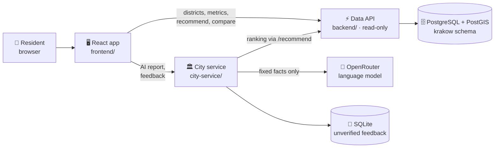

<h1 align="center">GdzieZamieszkać</h1>

<p align="center">
  <i>Choose a district of Kraków before you look for a flat. Eighteen districts, public data, and a source, a date and a caveat on every number.</i>
</p>

<p align="center">
  <b>Live demo:</b> <a href="https://demo.dchaudhury.com">demo.dchaudhury.com</a>
</p>

<p align="center">
  <a href="LICENSE"></a>
  <a href="https://github.com/Delta-43/GdzieZamieszkac/actions/workflows/ci.yml"></a>
  <a href="https://github.com/Delta-43/GdzieZamieszkac/commits/main"></a>
  
</p>

<p align="center">
  
  
  
  
  
  
</p>

<p align="center">
  
  
  
  
  
</p>

<p align="center">
  <a href="#-what-it-does">What it does</a> •
  <a href="#-how-it-works">How it works</a> •
  <a href="#-project-status">Status</a> •
  <a href="#-what-was-built-when">What was built when</a> •
  <a href="#-how-we-use-artificial-intelligence">AI use</a> •
  <a href="#-data-and-licences">Data</a> •
  <a href="#-run-it-and-check-it">Run it</a> •
  <a href="#-project-structure">Structure</a> •
  <a href="#-documentation">Documentation</a>
</p>

> [!IMPORTANT]
> **It is not a listings site.** It shows data about districts, not offers. No flat, broker or listing appears anywhere.
> The score compares the districts of one city with each other. It does not say how good it is to live there.

---

## 🧠 What it does

GdzieZamieszkać ("where to live") helps a person decide **where in Kraków to look** before they open a listings site.
It compares all 18 districts on 51 measures in seven categories: transport, demographics, livability, amenities, environment, cost and safety indicators.

- 🗺️ **A map first.** Districts coloured by one measure, a score, or a category. Darker always means *more*; the page says in words whether more is better for that measure. A table and a list hold the same values, so colour is never the only signal.
- 🎚️ **Your priorities, not ours.** Pick one of nine presets (student, family, remote worker, senior, budget, city life, quiet and green, couple, newly married) or weight six categories from 0 to 5. The ranking is computed in code. Place 1 is always the best.
- 🏷️ **Provenance on every number.** Each value says whether it is `observed`, `estimated` or `proxy`, and gives its source, licence, credit line, date, method and caveat.
- 🕳️ **Honest gaps.** A measure with no data shows the reason, never a zero. Kraków publishes no crime figures by district, so the app shows none.
- 🤖 **AI that narrates, never computes.** A language model writes the area reports and an optional personalised summary from a fixed list of facts. A guard drops any text with a number that is not in the facts. Every such text carries an AI label.
- 💬 **Resident feedback.** A person can report the rent they pay or a data problem. A report stays `unverified`, is never published, and never changes a score.
- 🔁 **Compare two to four districts**, side by side, with real table headers and no "winner".
- 🌍 **Polish by default, English on a toggle.** Text from the API arrives already in the chosen language and is never translated in the browser.

We pitch it as a **public service that a city could host**: the free tier needs no login, the city would hold the official data and later publish official notices and collect verified feedback. `docs/IDEA.md` has the full idea and says which parts exist and which are only concepts.

## 🏗️ How it works



- **Data API** (`backend/`). FastAPI, 16 operations, contract in `backend/openapi.yaml`. It loads the audited data of one city into memory, serves it read-only, and stores nothing about its users. The livability score is computed in code, by a copy of `data/sources/derived/scoring.py` that a test keeps in step.
- **City service** (`city-service/`). A separate FastAPI service with its own contract. It writes the personalised AI report and stores resident feedback in a local SQLite file. It is the only place a third party (the model provider) is called, and it stores and logs none of the typed text.
- **Frontend** (`frontend/`). A React single-page app. It calls only two origins, both ours: the data API and the city service. No fonts, map tiles, analytics or translation service come from a third party. The only thing it stores in the browser is the language choice.

### Rules the product keeps

| Rule | What it means in practice |
|---|---|
| Real data only | No invented number in the product. Fake data lives only in test fixtures. |
| Provenance travels with the value | Data kind, source, licence, credit line, as-of date, method, caveat. |
| The score is computed in code | A model may narrate it and never computes it. A test checks `/recommend` without weights equals the stored score. |
| Careful wording | "Recorded crimes per 10 000 residents". Never "safe" or "dangerous". |
| One city, one scale | Scores compare the districts of one city only. The city name comes from `/meta`. |
| Respect the licences | Every credit line is shown. Rents are district medians only. The accident data is non-commercial. |

## 📊 Project status

State on 4 October 2026, at the end of HackYeah.

| Component | Status | Detail |
|---|:---:|---|
| Data and database (`krakow` schema, 51 metrics, 22 migrations) | ✅ Built | 47 of 51 metrics have data for Kraków. The other four show their reason. |
| Data API (16 operations) | ✅ Built | 161 offline tests, lint clean. |
| City service (AI report, resident feedback) | ✅ Built | 31 offline tests. Needs an `OPENROUTER_LLM_KEY` for the AI report. |
| Frontend, phase 1 | ✅ Built | Home, districts map, district (with commute), find, compare, feedback, sources, not found. Tests, lint, type check and build pass. |
| Accessibility (WCAG 2.2 AA) | 🟡 Target | Automated checks pass on every page at two widths in both languages. The reviewer closed the accessibility and map review issues (#70, #72) on 4 October, but the repository holds no written record of a screen-reader or 400 percent zoom test. The accessibility statement in the app is marked as a draft. |
| Polish text | ✅ Reviewed | The native-speaking reviewer closed the Polish text review issues (#82, #83) on 4 October. The text of the API comes from the stored catalogue and is never translated in the browser. |
| Frontend, phase 2 | 🟡 Mostly | The district page shows commute times, past price changes with a backtest, and rent versus buy with similar districts (tasks F10, F11, F12). The household profile (task F9) is built in part: Find a district takes a work place and a budget. The household type and the children's ages wait for agreed weights. |
| Official notices, demand counts, identity checks for feedback | 💡 Concept | Shown only as a labelled concept. No endpoint and no data. |
| Public deployment | ✅ Live | <https://demo.dchaudhury.com>, on a team server since 4 October. Both services run in Docker behind Caddy and a Cloudflare Tunnel. There is no release pipeline and no off-server backup yet. |

**Known limits.** Rents are asking rents from a one-time snapshot, shown as district medians. Kraków has no recorded crime data, so safety uses road accidents and proxies. Commute times on long trips run fast. The price outlook is history and a backtest, not a forecast: we tested two methods and neither beat the naive baseline.

## 🕰️ What was built when

HackYeah asks teams to separate work done during the event from work that existed before. This section does that.
The first commit of this repository is the import of the earlier work. Every later commit is work done on site. The history is never rewritten.

| Part | When | Where to read the detail |
|---|---|---|
| Data collection and the Supabase database (`krakow` schema, migrations 0001 to 0017) | Before the event, 29 September to 2 October 2026, for research | First commit. The data pipeline and the data stay private. |
| Backend API (16 operations), its contract, its tests, `data/sources/derived/scoring.py`, and the backend and data documents | Before the event, same dates | First commit. Every change made on site to this code is listed in `ON_SITE_CHANGELOG.md`. |
| City service (AI report and resident feedback) | On site, 3 October 2026 | `docs/CITY_SERVICE_PLAN.md`, `city-service/` |
| Frontend, all of it | On site, 3 and 4 October 2026 | `frontend/README.md`, `ON_SITE_CHANGELOG.md` |
| Plain-language catalogue, units and Polish texts, school sports grounds and defibrillators, label wording (migrations 0018 to 0022) | On site, 4 October 2026 | `ON_SITE_CHANGELOG.md` |
| Rules, review process, CI, issue templates, README, sources document, pitch deck | On site, 3 and 4 October 2026 | `ON_SITE_CHANGELOG.md` |

The earlier work lived in a private repository. It was copied here with personal data removed and no change to the code logic.
`ON_SITE_CHANGELOG.md` has one entry per change, with the date and the reason.

## 🤖 How we use artificial intelligence

We disclose all significant use, as the event rules require.

- **The score is not AI.** It is computed in code and tested.
- **District reports.** A language model (`z-ai/glm-5.3-flash`, through OpenRouter) writes each report from a structured list of facts. A guard rejects any text that contains a number that is not in the facts. Reports are generated ahead of time and stored. The app labels every report as written by artificial intelligence.
- **Personalised AI report** (`city-service/`, new on site). The same model narrates the top three districts for a person's priorities, at request time. The ranking is computed in code and the model only writes text from a fixed fact list. The same number guard applies. Every answer carries an AI label. The typed text goes to OpenRouter and is neither stored nor logged by us.
- **Translation.** A language model (`deepseek/deepseek-v4.1-flash`, through OpenRouter) translates stored text between English and Polish. A glossary and a number check come first. Nothing is translated at request time.
- **Development.** We used Claude Code (Anthropic) to help write and review code, tests and documents, in both the earlier work and the work on site. People review it, and we can explain all of it. The written rules the agents followed are on the `develop` branch (see "Documentation").

## 🗃️ Data and licences

`docs/DATA_SOURCES.md` lists every source with its licence, credit line and caveat. Three things to know:

- **Sale prices** come from the national register of real estate prices (RCN), which is open data, from actual deeds and not asking prices.
- **Rents** are medians of asking rents from Otodom and OLX listings, taken once on 30 September 2026. The listings are not redistributed. Only district medians are shown.
- **Road accident data** (SEWiK) is free for non-commercial use with a credit line. Commercial use needs written approval. This is a hackathon prototype.

Other sources: OpenStreetMap (ODbL), GIOŚ air quality, Copernicus tree cover and green space, the Kraków noise map, BIP Kraków and Kraków open data, the nursery register (CC0), the timetable feeds of ZTP Kraków, and NBP price series.

## 🚀 Run it and check it

**Check it without any secret.** Every test runs offline, and CI runs the same commands on each pull request.

```bash
# Data API: lint and 161 offline tests
cd backend && python3 -m venv .venv && .venv/bin/pip install -r requirements-dev.txt
.venv/bin/ruff check . && .venv/bin/python -m pytest -q -m "not live"

# City service: lint and 31 tests (the API and the model are faked)
cd ../city-service && ../backend/.venv/bin/pip install -r requirements-dev.txt
../backend/.venv/bin/ruff check . && ../backend/.venv/bin/python -m pytest -q

# Frontend: contracts, lint, types, tests, build
cd ../frontend && npm ci && npm run check
```

**Run the live stack.** The data lives in a private Supabase project, so no credential is in this repository. Ask the team for a read-only `API_DB_URL`, and for an `OPENROUTER_LLM_KEY` if you want the AI report.

```bash
cd backend
API_DB_URL=... CITY=krakow .venv/bin/uvicorn app.main:app_from_env --factory --port 8000
curl localhost:8000/v1/meta

cd ../city-service
OPENROUTER_LLM_KEY=... ../backend/.venv/bin/uvicorn app.main:app_from_env --factory --port 8100 --no-access-log

cd ../frontend && npm run dev          # http://localhost:5173, forwards /v1 to both services
```

**The public demo** is at <https://demo.dchaudhury.com>. The data API and the city service run as Docker containers, built from `backend/Dockerfile` and `city-service/Dockerfile`, with `ENVIRONMENT=production`. Caddy serves the built frontend and both services from that one address, so the browser calls no other origin. A Cloudflare Tunnel connects the address to Caddy, and no port of the server is open to the internet. The module guides explain the settings, the security measures and the Docker builds.

## 🧰 Tech stack

| Layer | What we use |
|---|---|
| Data API | Python 3.14, FastAPI, Pydantic, a read-only PostgreSQL role, PostGIS geometry served as GeoJSON |
| City service | FastAPI, SQLite, OpenRouter (`z-ai/glm-5.3-flash`) |
| Frontend | React 19, React Router, TanStack Query, i18next, `openapi-fetch` and `openapi-typescript`, Vite |
| Quality | pytest, ruff, Vitest, Testing Library, `vitest-axe`, ESLint with `jsx-a11y`, GitHub Actions |
| Look | Lato (bundled from `@fontsource/lato`, SIL OFL 1.1), the colours of krakow.pl and the shapes of the Gov.pl design system. No logo, crest or photo of the city. |
| Data | PostgreSQL with PostGIS on Supabase, loaded by a private pipeline |

## 📁 Project structure

```
backend/                  Data API: FastAPI app, contract (openapi.yaml), tests, Dockerfile
city-service/             AI report and resident feedback: FastAPI app, its own contract, tests, Dockerfile
frontend/                 React app, generated API types, theme tokens, tests, and the frontend guide files
server/migrations/krakow/ Numbered SQL for the krakow schema (0001 to 0017 imported, 0018 to 0022 on site)
server/scripts/           run_servers.sh, data build scripts and audit tools
data/sources/derived/     scoring.py, the scoring code the backend copies
docs/                     Idea, data sources, data dictionary, design, plans, data-review records
changelog/                One file per pull request, built into ON_SITE_CHANGELOG.md before each merge into main
scripts/                  build_changelog.py
.github/                  CI, issue templates, pull request template
pitch/                    The final pitch decks for the Smart City and Artificial Intelligence tracks (HTML and PDF), and the cover images
```

## 📚 Documentation

| Read this | For |
|---|---|
| `docs/IDEA.md` | The idea, what exists, what is a concept, how we differ, the known limits |
| `docs/DATA_SOURCES.md` | Every source with licence, credit line, how figures are built, the gaps |
| `docs/DATA_DICTIONARY.md` | Tables, columns and the metric catalogue |
| `backend/openapi.yaml`, `city-service/openapi.yaml` | The two API contracts. Change the contract first, then the code. |
| `backend/README.md`, `city-service/README.md`, `frontend/README.md` | How each module works, its settings and how to run it |
| `docs/DESIGN.md` | The look and the components that carry the data rules |
| `docs/CITY_SERVICE_PLAN.md` | What the city service does and what it never does |
| `docs/BACKEND_PLAN.md`, `docs/API_CONTRACT_DRAFT.md` | The reasoning behind the API, the price history and the backtest |
| `frontend/ACCESSIBILITY.md`, `frontend/REVIEW_CHECKLIST.md` | The WCAG 2.2 AA rules and the checklist for every change |
| `ON_SITE_CHANGELOG.md` | Every change made during the event, with date and reason |

`main` holds the released project. The working files for the team and its agents (the rules in `AGENTS.md`, the review process in `REVIEW.md`, the module hand-offs, the task lists and the first deck drafts) stay on the [`develop`](https://github.com/Delta-43/GdzieZamieszkac/tree/develop) branch, with their full history. Older documents that name them refer to that branch.

## 👥 Team

`Delta-43` (coordinator, backend, data and city service), `Rysia` (frontend), `unicorn-alex` (Polish text, review and the pitch).

## 📄 Licence

Proprietary. Copyright (c) 2026 the GdzieZamieszkać team. All rights reserved. The repository is public so that readers can look at the work.
Publishing it does not grant a licence to copy, modify or use it. See `LICENSE`.
Third-party data and components keep their own licences. See `docs/DATA_SOURCES.md`.
